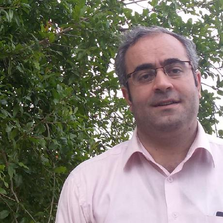
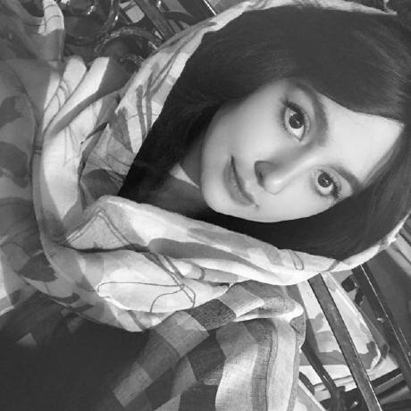
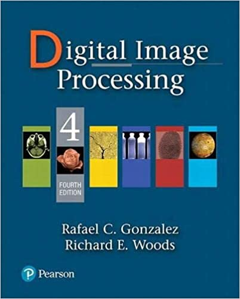
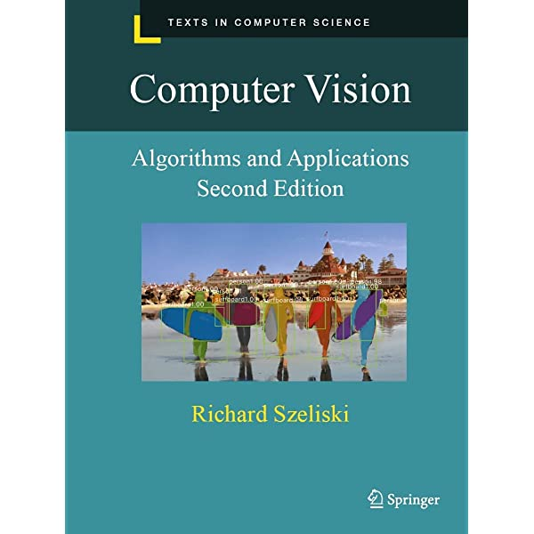
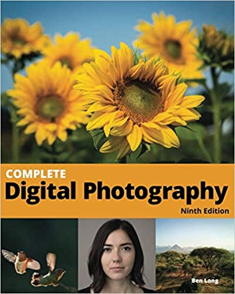

# Fundamentals of Computer Vision and Digital Image Processing

<table>
  <tr>
    <th colspan="2"><span style="font-weight:bold">Presenter: </span>Ali Nazari</th>
  </tr>
  <tr>
    <td></td>
  </tr>
  <tr>
    <td colspan="5"><span style="font-weight:bold">Teaching Assistants:</span></td>
  </tr>
  <tr>
    <td><a href="https://github.com/tarabarghian">Tara Barghian</a></td>
  </tr>
  <tr>
    <td></td>
  </tr>
</table>

### **Index:**
- [Course Overview](#Course-Overview)
- [TextBooks](#TextBooks)
- [Syllabus](#syllabus)
- [Class Time and Location](#Class-Time-and-Location)
- [Grading](#Grading)
- [Recommended Links](#links)

## <a name="Course-Overview"></a>Course Overview:
```javascript
In this course, we try to teach fundamentals of digital image processing and computer vision including theories and techniques for undergraduate students. 
Not only do we attempt to cover fundamental concepts, but also we investigate basic codes in DIP. Particularly, some Python libraries such as Pillow and OpenCV are considered. 
In addition, if we have time, Digital photography is skimmed.

It is worth mentioning that we explain concepts in the first part of the class 
and practice them in the second part.
```
## <a name="TextBooks"></a>TextBooks:

<table class="tg">
  <tr>
    <td class="tg-0lax"></td>
    <td class="tg-0lax"></td>
    <td class="tg-0lax"></td>
    <td class="tg-0lax"></td>
  </tr>
</table>

```
Main TextBooks:
```
* [Digital Image Processing, 4rd edition](https://www.imageprocessingplace.com/DIP-4E/dip4e_main_page.htm)
  Authors: Rafael C. GONZALES and Richard E. Woods
  ISBN:9780133356724
* [Computer Vision: Algorithms and Applications, 2nd ed](https://szeliski.org/Book/)
  Author: Richard Szeliski
  ISBN: 9783030343712

```
Additional Texts:
```
* [Pillow: Image Processing with Python](https://www.amazon.com/Pillow-Processing-Python-Michael-Driscoll/dp/B08ZBRS1WM)
  Author: Michael Driscoll 
  ‏ ISBN  : 979-8585391583 
* [Complete digital photography, Tenth Edition](https://www.amazon.com/Complete-Digital-Photography-Ben-Long/dp/1732636923)
  Author: Ben Long 
  ISBN: 9781732636927 
  

 ## <a name='syllabus' />Syllabus


## <a name="Class-Time-and-Location"></a>Class Time and Location:
(Fall 2022),
Monday  09:00-10:30 AM,
Wednesday  09:00-10:30 AM.

# <a name="Grading"></a>Grading:

Final Exam –60% </br>
Quiz –10%  </br>
Homework -10% </br>
Practical homework -20%</br>
Bonus mark to active student -5% </br>

## <a name="Questions"></a>Questions?
You can ask your question by sending a mail to al_nazari@sbu.ac.ir or ali.nazari.ir@gmail.com 

## <a name="links"></a>Recommended Links:
### <a name="recom_edu"></a>Recommended Links for successful path in CS:
1. [Path to a free self-taught education in Computer Science](https://github.com/ossu/computer-science) 
